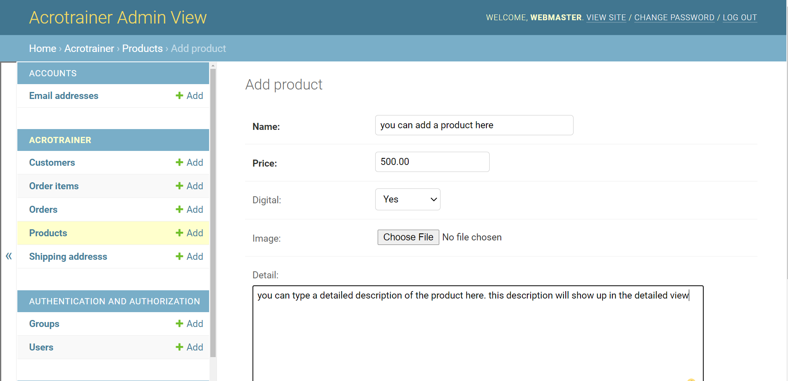
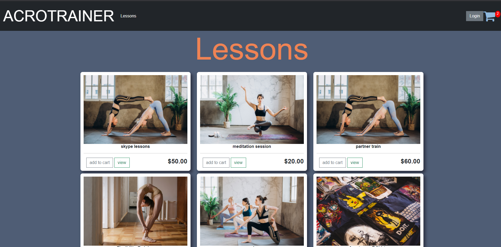
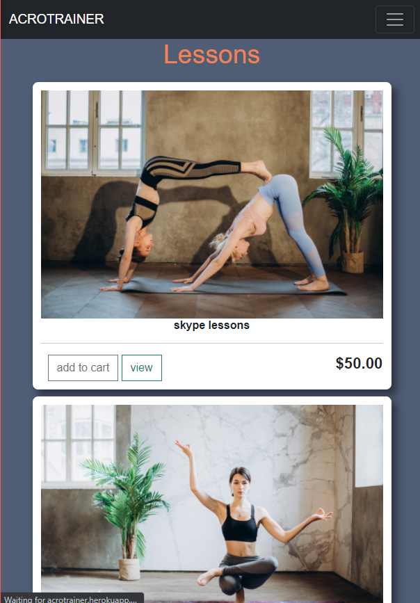
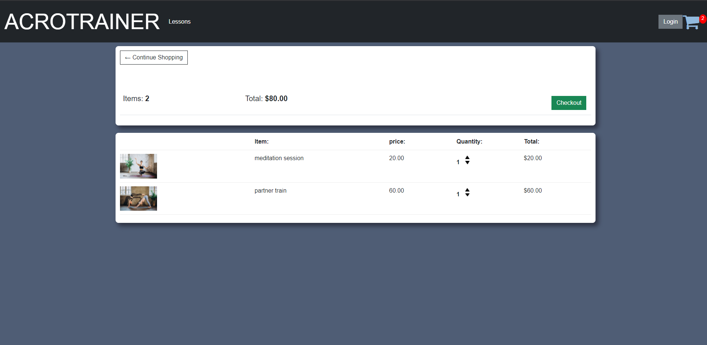
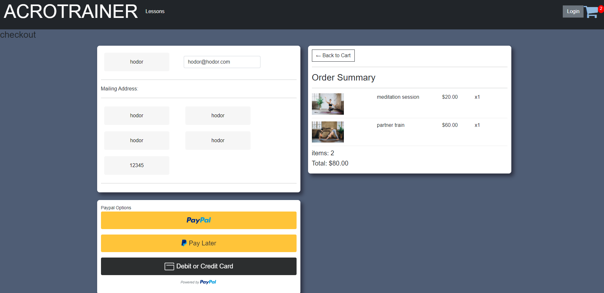
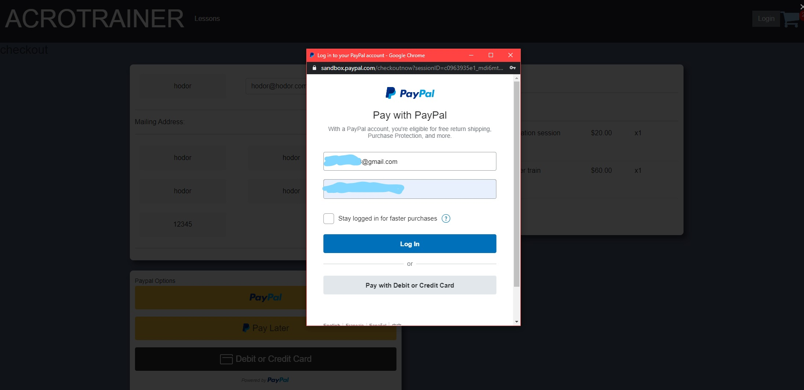

# this is a website I am prototyping for a friends Business. 

## want to check out the site?
check the current state of the site.
https://acrotrainer.herokuapp.com/

what this site can do...

Admin can see a list of all available products.

Admin can add products to site with no code skills needed.

a user enters the site from the landing page.

a user can sign up and a verification email is sent out to verify account.

a user can log in and log out change email adress and reset password.

admin can add digital or physical products to page. if product is digital no address is required or saved to backend. if product requires shipping completed orders are saved to backend with shipping address. 

a logged in user can add items to cart.

the cart icon updates to let user know how many items are in the cart.

all templates were built with bootstrap and look great on mobile.

logged in user can see items in cart and prices in cart update accordingly.

logged in user can checkout. price and items are sent to backend.

guest has same capabilities as logged in user.

once order is completed cart is cleared.

a user can checkout with paypal

paypal payment success was tested in paypals sandbox. the correct value in the cart is processed and the money is sent from the customer to the buyer.

### initial setup:
this is a Django application in a Docker container with a postgres database that will be hosted off of heroku where the app will be launched.

### testing:
will test forms, models, urls, and views to ensure app runs smoothly and continues working while updates are being made.

